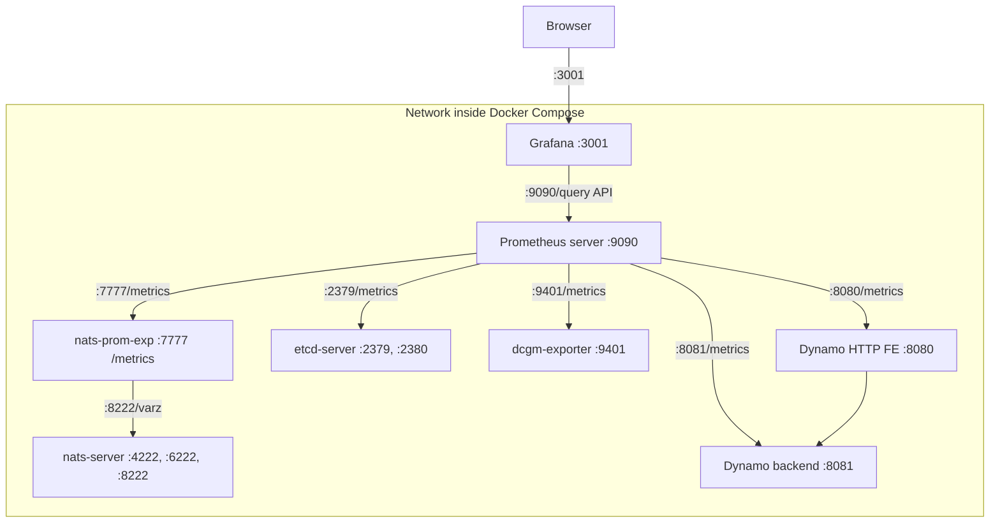

# Observability - Metrics

**Status:**  Approved

**Authors:** nnshah1, keivenchang <!-- List the authors/team responsible for this proposal -->

**Category:** Architecture <!-- Choose from: Architecture | Process | Guidelines -->

**Replaces:** N/A <!-- Link to previous proposal if this replaces one -->

**Replaced By:** N/A <!-- Link to proposal that replaces this one if applicable -->

**Sponsor:** keivenchang <!-- Name of code owner or maintainer to shepherd the process -->

**Required Reviewers:** Ryan Olson, Graham King <!-- Names of technical leads that are required for acceptance -->

**Review Date:** 07/01/2025 <!-- Date when this proposal should be reviewed -->

**Pull Request:** https://github.com/ai-dynamo/enhancements/pull/21 <!-- Link to the PR containing this proposal -->

**Implementation PR / Tracking Issue:** https://github.com/ai-dynamo/dynamo/pull/2008 <!-- Link to PR or tracking issue for implementation -->

# Summary

<!-- [Required] Provide a concise summary of the proposal - what it does and why it's needed -->

This document outlines the current state and future direction of the Metrics API for Dynamo. The `MetricsRegistry` framework built into the `DistributedRuntime` provides comprehensive observability capabilities for Dynamo components. This proposal documents the current implementation and outlines improvements for enhanced observability across Dynamo components.

# Motivation

<!-- [Required] Describe the problem that needs to be addressed with enough detail for someone familiar with the project to understand. Generally one to two short paragraphs. Cover what the issue is and why it needs to be addressed. Link to github issues if relevant. -->

The `MetricsRegistry`API provides automatic metrics collection for component endpoints and supports custom metrics creation. While the current system provides a solid foundation, there are opportunities to enhance the observability capabilities, improve the developer experience, and ensure comprehensive coverage across all Dynamo components.

## Goals

<!-- [Optional - if not applicable omit] List out any additional goals in bullet points. Goals may be aspirational / difficult to measure but guide the proposal. -->

This proposal aims to:

* Document and standardize the current `MetricsRegistry` implementation
* Ensure consistent metrics visibility across all Dynamo components
* Provide clear guidelines for developers on how to use the metrics system
* Establish best practices for custom metrics implementation
* Enable comprehensive observability for production deployments

### Non Goals

<!-- [Optional - if not applicable omit] List out any items which are out of scope / specifically not required in bullet points. Indicates the scope of the proposal and issue being resolved. -->

* Implementing new metrics backends beyond Prometheus
* Adding complex metrics aggregation or alerting systems
* Modifying the core `DistributedRuntime` behaviors

## Requirements

<!-- [Optional - if not applicable omit] List out any additional requirements in numbered subheadings. Requirements should be measurable and will be used to determine if a DEP has been successfully implemented or not. Use all-caps, bolded terms like MUST and SHOULD when describing each requirement. -->

### REQ 1: Automatic Metrics Collection

* **Description:** All component endpoints using the `DistributedRuntime` framework MUST automatically collect basic metrics including request count, duration, bytes transferred, and error counts without requiring any code changes.
* **Rationale:** Automatic metrics collection ensures consistent observability across all components and reduces the burden on developers to implement basic monitoring.
* **Measurability:** Verify that all component endpoints automatically expose metrics.

### REQ 2: Standardized Metric Naming

* **Description:** All metrics MUST follow the standard `dynamo_component_*`, `dynamo_frontend_*`, and other `dynamo_<specific-component>_*` prefix in names. Additional **labels** such as `dynamo_namespace`, `dynamo_component`, `dynamo_endpoint` are automatically added to the names.
* **Rationale:** Consistent naming and labeling enables effective aggregation, filtering, and analysis across the entire Dynamo ecosystem.
* **Measurability:** Confirm that all metrics follow the established naming patterns and include the required labels.

### REQ 3: Custom Metrics Support

* **Description:** The `MetricsRegistry` MUST support creation of additional custom metric types (counters, gauges, histograms) with proper labeling and integration with the automatic metrics system.
* **Rationale:** Custom metrics allow components to expose domain-specific observability data while maintaining consistency with the overall metrics framework.
* **Measurability:** Verify that components can create and use custom metrics through the `MetricsRegistry` interface, implemented in the `DistributedRuntime` framework.

### REQ 4: HTTP Metrics Endpoint

* **Description:** Each process containing one or more components and/or endpoints MUST expose metrics in Prometheus format via HTTP endpoints that can be scraped by monitoring systems.
* **Rationale:** HTTP endpoints enable integration with standard monitoring tools like Prometheus, Grafana, and other observability platforms.
* **Measurability:** Confirm that components expose `/metrics` endpoints that return valid Prometheus-formatted data.

### REQ 5: Developer Documentation

* **Description:** Comprehensive documentation MUST be provided for developers on how to use the metrics system, including examples and best practices.
* **Rationale:** Clear documentation reduces the learning curve and ensures consistent implementation across teams.
* **Measurability:** Verify the existence and completeness of developer guides, examples, and API documentation.

# Proposal

<!-- [Required] Describe the high level design / proposal. Use sub sections as needed, but start with an overview and then dig into the details. Try to provide images and diagrams to facilitate understanding. -->

The `MetricsRegistry` implementation provides a comprehensive metrics framework built into the `DistributedRuntime`. This proposal documents the existing system and outlines enhancements for improved observability.

## MetricsRegistry Trait Foundation

The `MetricsRegistry` trait serves as the core abstraction for all metrics collection in Dynamo. It provides a unified interface for creating and managing Prometheus-compatible metrics with automatic label injection and hierarchical naming support.

### Trait Definition and Architecture

The `MetricsRegistry` trait is implemented by four key components in Dynamo's distributed runtime architecture:

```rust
pub trait MetricsRegistry: Send + Sync + DistributedRuntimeProvider {
    // Hierarchy management methods
    fn basename(&self) -> String;
    fn hierarchy(&self) -> String;
    fn parent_hierarchy(&self) -> Vec<String>;
    
    // Metric creation methods
    fn create_counter(&self, name: &str, description: &str, labels: &[(&str, &str)]) -> anyhow::Result<prometheus::Counter>;
    fn create_gauge(&self, name: &str, description: &str, labels: &[(&str, &str)]) -> anyhow::Result<prometheus::Gauge>;
    fn create_histogram(&self, name: &str, description: &str, labels: &[(&str, &str)], buckets: Option<Vec<f64>>) -> anyhow::Result<prometheus::Histogram>;
    fn create_intcounter(&self, name: &str, description: &str, labels: &[(&str, &str)]) -> anyhow::Result<prometheus::IntCounter>;
    fn create_intgauge(&self, name: &str, description: &str, labels: &[(&str, &str)]) -> anyhow::Result<prometheus::IntGauge>;
    
    // Vector metrics with dynamic labels
    fn create_countervec(&self, name: &str, description: &str, const_labels: &[&str], const_label_values: &[(&str, &str)]) -> anyhow::Result<prometheus::CounterVec>;
    fn create_intcountervec(&self, name: &str, description: &str, const_labels: &[&str], const_label_values: &[(&str, &str)]) -> anyhow::Result<prometheus::IntCounterVec>;
    fn create_intgaugevec(&self, name: &str, description: &str, const_labels: &[&str], const_label_values: &[(&str, &str)]) -> anyhow::Result<prometheus::IntGaugeVec>;
    
    // Output method
    fn prometheus_metrics_fmt(&self) -> anyhow::Result<String>;
}
```

### Hierarchical Implementation

The trait is implemented across Dynamo's hierarchical architecture:

```
DistributedRuntime (basename: "", hierarchy: "")
└── Namespace (basename: "namespace_name", hierarchy: "namespace_name")
    └── Component (basename: "component_name", hierarchy: "namespace_name_component_name")  
        └── Endpoint (basename: "endpoint_name", hierarchy: "namespace_name_component_name_endpoint_name")
```

Each level in the hierarchy provides:
- **Scoped Metrics**: Metrics created at any level automatically include all parent context
- **Automatic Labels**: When `USE_AUTO_LABELS = true`, metrics automatically receive:
  - `dynamo_namespace` - The namespace name (sanitized for Prometheus compliance)
  - `dynamo_component` - The component name (sanitized for Prometheus compliance) 
  - `dynamo_endpoint` - The endpoint name (sanitized for Prometheus compliance)
- **Hierarchical Registration**: Metrics are registered at all levels in the hierarchy for comprehensive visibility

### Key Features

**Automatic Label Injection**: All metrics automatically receive hierarchical labels without manual specification:

```rust
// Creating a counter at the endpoint level automatically gets all three labels
let counter = endpoint.create_counter("requests", "Total requests processed", &[])?;
// Results in: dynamo_component_requests{dynamo_namespace="ns",dynamo_component="comp",dynamo_endpoint="ep"} 1
```

**Name Validation and Sanitization**: The trait automatically validates and sanitizes metric names to ensure Prometheus compliance:
- Removes invalid characters (preserving alphanumeric, underscores, and colons)
- Validates against Prometheus naming pattern: `[a-zA-Z_:][a-zA-Z0-9_:]*`
- Prepends `dynamo_component_` prefix to all metric names

**Prometheus Integration**: All metrics are:
- Registered in a shared Prometheus registry for each hierarchy level
- Automatically formatted for Prometheus consumption via `prometheus_metrics_fmt()`
- Available via HTTP `/metrics` endpoints when using the system status server

### Usage Examples

**Basic Metric Creation**:
```rust
// Get a component endpoint
let endpoint = component.endpoint("my_endpoint");

// Create various metric types
let counter = endpoint.create_counter("requests", "Total requests", &[])?;
let gauge = endpoint.create_gauge("queue_size", "Current queue size", &[])?;
let histogram = endpoint.create_histogram("latency", "Request latency", &[], Some(vec![0.1, 0.5, 1.0, 2.5, 5.0]))?;

// Use the metrics
counter.inc();
gauge.set(42.0);
histogram.observe(0.25);
```

**Custom Labels**:
```rust
// Add custom labels in addition to automatic ones
let counter = endpoint.create_counter("processed", "Items processed", &[("type", "batch"), ("priority", "high")])?;
// Results in: dynamo_component_processed{dynamo_namespace="ns",dynamo_component="comp",dynamo_endpoint="ep",type="batch",priority="high"} 1
```

**Vector Metrics for Dynamic Labels**:
```rust
// Create a counter vector for dynamic labeling
let counter_vec = endpoint.create_countervec("responses", "HTTP responses", &["status_code", "method"], &[("service", "api")])?;

// Use with dynamic labels
counter_vec.with_label_values(&["200", "GET"]).inc();
counter_vec.with_label_values(&["404", "POST"]).inc();
```

### System Architecture Integration

The Dynamo metrics system follows a layered architecture that automatically collects, stores, and visualizes performance data across all components. This design ensures comprehensive observability with minimal developer effort.

The metrics system operates on three main layers:

1. **Collection Layer**: Dynamo components automatically generate metrics during operation
2. **Storage Layer**: Prometheus collects and stores metrics data for historical analysis
3. **Visualization Layer**: Grafana provides dashboards and alerts based on the collected data

The metrics system follows a hierarchical architecture where metrics are collected from individual components and aggregated through the monitoring stack:



**Key Components:**
- **Dynamo Components**: Individual components expose metrics via HTTP endpoints (e.g., `:8080/metrics`, `:8081/metrics`)
- **Prometheus Server**: Collects and stores metrics from all Dynamo services and infrastructure components
- **Grafana**: Provides dashboards and visualization by querying the Prometheus Server
- **Infrastructure Metrics**: NATS, etcd, and DCGM exporter provide additional system-level metrics

The topology ensures that all metrics from Dynamo components using the `DistributedRuntime` framework are automatically collected and made available for monitoring and alerting.

The metrics system organizes data in a logical hierarchy that mirrors Dynamo's distributed architecture:

- **Runtime Level**: Global metrics across the entire system
- **Namespace Level**: Metrics scoped to specific model or service namespaces
- **Component Level**: Metrics for specific components within a namespace
- **Endpoint Level**: Metrics for individual API endpoints within a component

This hierarchical structure allows for both broad system-wide monitoring and detailed component-specific analysis.

Dynamo automatically exposes metrics with the `dynamo_` name prefixes and adds the following labels: `dynamo_namespace`, `dynamo_component`, and `dynamo_endpoint` to indicate which component is providing the metric.

All component endpoints using the `DistributedRuntime` framework automatically collect the following metrics:

**Counters:**
- `dynamo_component_requests_total` - Total requests processed
- `dynamo_component_request_bytes_total` - Total bytes received
- `dynamo_component_response_bytes_total` - Total bytes sent
- `dynamo_component_errors_total` - Total errors (with error_type labels)

**Histograms:**
- `dynamo_component_request_duration_seconds` - Request processing time

**Gauges:**
- `dynamo_component_concurrent_requests` - Currently processing requests
- `dynamo_component_system_uptime_seconds` - DistributedRuntime uptime

When using Dynamo HTTP Frontend (`--framework VLLM` or `--framework TENSORRTLLM`), these metrics are automatically exposed with the `dynamo_frontend_*` prefix and include `model` labels containing the model name:

- `dynamo_frontend_inflight_requests` - Inflight requests (gauge)
- `dynamo_frontend_input_sequence_tokens` - Input sequence length (histogram)
- `dynamo_frontend_inter_token_latency_seconds` - Inter-token latency (histogram)
- `dynamo_frontend_output_sequence_tokens` - Output sequence length (histogram)
- `dynamo_frontend_request_duration_seconds` - LLM request duration (histogram)
- `dynamo_frontend_requests_total` - Total LLM requests (counter)
- `dynamo_frontend_time_to_first_token_seconds` - Time to first token (histogram)

Some components expose additional metrics specific to their functionality:

- `dynamo_preprocessor_*` - Metrics specific to preprocessor components

All metrics automatically include:
- `dynamo_namespace` - The namespace name
- `dynamo_component` - The component name  
- `dynamo_endpoint` - The endpoint name

The system exposes metrics in standard Prometheus format:

```prometheus
# HELP dynamo_component_requests_total Total number of requests processed by component endpoint
# TYPE dynamo_component_requests_total counter
dynamo_component_requests_total{dynamo_component="example",dynamo_endpoint="generate",dynamo_namespace="default"} 42

# HELP dynamo_component_request_duration_seconds Time spent processing requests by component endpoint
# TYPE dynamo_component_request_duration_seconds histogram
dynamo_component_request_duration_seconds_bucket{dynamo_component="example",dynamo_endpoint="generate",dynamo_namespace="default",le="0.1"} 35
dynamo_component_request_duration_seconds_sum{dynamo_component="example",dynamo_endpoint="generate",dynamo_namespace="default"} 2.5
dynamo_component_request_duration_seconds_count{dynamo_component="example",dynamo_endpoint="generate",dynamo_namespace="default"} 42
```

The `MetricsRegistry` trait is implemented by `DistributedRuntime`, `Namespace`, `Component`, and `Endpoint`, providing a hierarchical approach to metric collection that matches Dynamo's distributed architecture:

- **DistributedRuntime**: Global metrics across the entire runtime
- **Namespace**: Metrics scoped to a specific dynamo_namespace
- **Component**: Metrics for a specific dynamo_component within a namespace
- **Endpoint**: Metrics for individual dynamo_endpoint within a component

This hierarchical structure allows you to create metrics at the appropriate level of granularity for your monitoring needs.

Components can add custom metrics using the endpoint's factory methods:

The metrics system includes pre-configured Grafana dashboards for comprehensive monitoring:

- **General Dynamo Dashboard**: `grafana-dynamo-dashboard.json` - Provides overview of both software and hardware metrics
- **DCGM GPU Metrics Dashboard**: `grafana-dcgm-metrics.json` - Specialized dashboard for GPU monitoring

**Coming Soon**: Comprehensive Kubernetes deployment and monitoring information will be available soon, including:
- Helm charts for easy deployment
- Kubernetes-native metrics collection
- Cluster-wide observability solutions
- Integration with Kubernetes monitoring ecosystem

# Alternate Solutions

<!-- [Required, if not applicable write N/A] List out solutions that were considered but ultimately rejected. Consider free form - but a possible format shown below. -->

## Alt 1: Deprecated Metrics Component

The original `metrics` component was a separate process that collected and aggregated metrics from workers. This approach has been deprecated in favor of the integrated `MetricsRegistry` framework.

**Pros:**
* Separation of concerns with dedicated metrics process
* Centralized metrics collection and aggregation

**Cons:**
* Additional complexity and deployment overhead
* Dependency on external messaging for metrics collection
* Increased latency and potential data loss
* More complex debugging and troubleshooting

**Reason Rejected:**
* The integrated `MetricsRegistry` approach provides better performance, reliability, and developer experience while reducing operational complexity.

## Alt 2: Third-Party Metrics Libraries

Using third-party metrics libraries directly without the `MetricsRegistry` abstraction.

**Pros:**
* Leverages well-tested existing libraries
* Potentially quicker initial setup

**Cons:**
* Inconsistent metrics across components
* No automatic labeling or organization
* Higher maintenance burden
* Potential interoperability issues

**Reason Rejected:**
* The `MetricsRegistry` provides a unified interface that ensures consistency and reduces maintenance overhead while leveraging proven Prometheus libraries under the hood.

## Alt 3: Custom Metrics Implementation

Building a completely custom metrics system from scratch.

**Pros:**
* Full control over implementation
* Tailored to specific Dynamo requirements

**Cons:**
* Significant development time and resources
* Need to maintain compatibility with monitoring ecosystems
* Risk of reinventing existing solutions

**Reason Rejected:**
* The current `MetricsRegistry` approach provides the benefits of a custom solution while leveraging proven Prometheus standards and reducing development effort.
