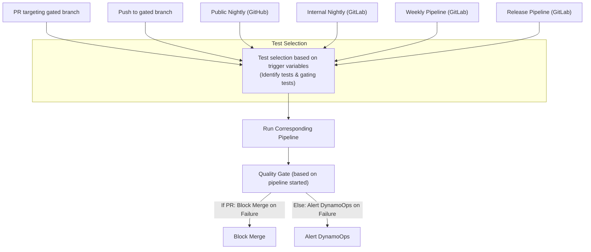

# Dynamo Testing in CI Strategy

## Status
Draft

## Authors
Pavithra Vijayakrishnan

## Category
Test Design Proposal

## Required Reviewers
Meenakshi, Harrison, Neelay

---

## Summary
Dynamo is a distributed, high-throughput inference framework. This strategy defines a layered, automated, and scalable approach to testing, CI/CD, and observability, with the objective of achieving high reliability and rapid iteration.

---

## Goals

This document serves as the comprehensive guideline for testing and CI/CD in the Dynamo project. Its goals are to:

- **Establish a Comprehensive Testing Strategy:** Define a layered, automated, and scalable approach to testing, covering all aspects from linting and unit tests to integration, end-to-end (E2E), performance, stress, and security tests.
- **Map CI/CD Workflows to Test Execution:** Clearly outline the different CI/CD workflows and pipeline runs, specifying which tests are triggered in each pipeline (pre-commit, PR, nightly, release, etc.) and how dynamic test selection is achieved.
- **Define Testing Metrics and Adequacy:** Set clear metrics for test coverage, adequacy, and quality, including line, function, and path coverage, as well as criteria for gating and prime path testing.
- **Facilitate Debuggability and Reliability:** Recommend robust logging, monitoring, and alerting practices to improve test debuggability, enable rapid root cause analysis, and ensure that test failures are actionable and visible to the right owners.
- **Ensure Continuous Improvement:** Provide mechanisms for tracking test flakiness, coverage trends, and performance regressions, and establish clear ownership and escalation paths for test failures.

By achieving these goals, the Dynamo project aims to ensure high reliability, rapid iteration, and continuous improvement in both code quality and system robustness.

## Motivation
- Dynamo uses multiple layers of testing: linting, unit, integration, end-to-end (E2E), performance, benchmark, stress, and security tests.
- Each test type targets a specific aspect of system quality.
- Tests are integrated into CI/CD pipelines to ensure reliability, determinism, performance, visibility, debuggability, and security at every stage of development.


## Types of tests

### Linting & Static Analysis
- **Tools:** pre-commit, clippy, rustfmt, black, flake8, semgrep
- **Trigger:** Every commit/PR (gated by copyPR bot)

### Unit Tests
- **Coverage Target:** 85% (Rust), 80% (Python)
- **Pytest Location:** tests/ directory within the respective component
- **Rust Location:** Co-located with the corresponding src files
- **Trigger:** Every PR, push to gated branch

### Integration Tests
- **Location:** tests/ directory within the respective component
- **Trigger:** PRs, push to gated branch, nightly, weekly, Release
- **Focus:** Real service interaction, distributed scenarios

### End-to-End (E2E) Tests
- **Location:** tests/
- **Trigger:** PRs, push to gated branch, nightly, weekly, Release
- **Focus:** User workflows, CLI/API

### Performance/Benchmark Tests
- **Location:** tests/benchmark/
- **Trigger:** Nightly, weekly, Release
- **Metrics:** Latency, throughput, resource usage

### Stress Tests
- **Location:** tests/stress/
- **Trigger:** weekly
- **Vision:** Early detection of rare, resource and distributed failures

### Security Tests
- **Location:** tests/security/
- **Trigger:** nightly, weekly, release

---


## Test organization and directory Structure 

For the detailed test directory structure and the definitions of all test markers used in the Dynamo project, please refer to the documentation [Dynamo Test Strategy](./0008-testing-strategy.md)

``` shell
dynamo/
├── lib/
│   ├── runtime/
│   │   ├── src/
│   │   │   └── lib.rs          # Rust code + unit tests inside
│   │   └── tests/              # Optional Rust integration tests specific to runtime
│   |   └── benches/  
│   ├── llm/
│   │   └── src/
│   │       └── lib.rs          # Unit tests here
│   │   └── tests/              # Optional Rust integration tests specific to runtime
│   |   └── benches/  
│   └── ...
├── components/
│   ├── planner/
│   │   └── tests/              # Python unit and integration tests for planner module
│   ├── backend/
│   │   └── tests/              # Python unit and integration  tests for backend module
│   └── ...
├── tests/                      # End-to-end tests
    ├── server
    ├── kvbm
    ├── ...                     # Other python end-to-end tests
    ├── benchmark/
    └── fault_tolerance/
```

---

## Test Segmentation and Grouping

Dynamo's test suite is segmented by component, h/w requirements, and environment to enable targeted CI runs, clear ownership, and debugging. Pytest markers are used for Python, and module/feature-based grouping is used for Rust.

### Python (pytest) Markers

Markers are used to select, group, and report on tests in CI and local runs. All tests must have the below markers Example markers:

- **Lifecycle:**
  - pre_commit, pre_merge, nightly, weekly, release
- **Hardware:** 
  - Specify the lowest h/w requirement. For example if a test can be run on both cpu and gpu, mark it as gpu_0.
  - gpu_0, gpu_1, gpu_2, gpu_4, gpu_8
  - [Optional] h100, gb200, a100, l40
- **Test Type:**
  - unit, integration, e2e, stress,
  - (Others) smoke, performance, scalability, distributed, flaky, security, conformance
- **Framework/Backend: (if applicable)**
  - vllm, trtllm, sglang, custom_backend

**Other optional markers (not used in CI):**
- **Component/Feature:**
  - kv_cache, kvbm, planner, router, api, config, logging, security, data_plane, control_plane

**pyproject.toml registration example:**
```
[pytest]
markers =
    pre_merge: marks tests to run before merging
    nightly: marks tests to run nightly
    weekly: marks tests to run weekly
    gpu_0: marks tests to run on CPU
    gpu_1: marks tests to run on GPU
    gpu_2: marks tests to run on 2GPUs
    gpu_4: marks tests to run on 4GPUs
    gpu_8: marks tests to run on 8GPUs
    e2e: marks tests as end-to-end tests
    integration: marks tests as integration tests
    unit: marks tests as unit tests
    stress: marks tests as stress tests
    vllm: marks tests as requiring vllm
    trtllm: marks tests as requiring trtllm
    sglang: marks tests as requiring sglang
    h100: marks tests to run on H100
    performance: marks performance tests
```

**Usage Example:**
```python
@pytest.mark.integration
@pytest.mark.gpu_2
@pytest.mark.vllm
def test_kv_cache_multi_gpu_behavior():
    ...
```

### Rust (cargo test) Segmentation

- By features: Use Cargo features to enable/disable test groups: `cargo test --features planner`
- By #[ignore]: Mark slow or special-case tests: `#[ignore]`
- Place all integration tests behind the integration feature gate. These tests will run in CI when using either cargo test --features integration or cargo test --all-features.


**Example:**
```rust
#[cfg(test)]
mod kv_cache_tests {
    #[test]
    fn test_kv_cache_basic() { /* ... */ }
    #[test]
    #[ignore]
    fn test_kv_cache_long_running() { /* ... */ }
}
```


## CI Vision

The Dynamo test strategy and CI/CD pipelines are guided by the following key criteria:
- **Fail Fast:** Early termination on critical failures, quick lint/syntax checks, and immediate feedback.
- Dynamic, code-aware test selection is implemented in CI. Dynamically choose the trigger varaibles.
- **Parallelization:** Matrix builds, parallel test execution, and concurrent pipeline stages.
- **Caching & Efficiency:** Build and test result caching, Docker layer caching, and resource-aware scheduling. Currenlty have sccache.
- **Flakiness Management:** Automatic retries, quarantine for unstable tests, and flakiness analytics.
- **Environment Isolation:** Clean, containerized builds and reproducible infrastructure.
- **Reporting:** Coverage trends, performance regression detection, and resource usage metrics. All test failures and regressions are actionable and monitored.
- Test ownership and escalation paths are documented.
- Long-standing (weekly scheduled) CI for stress tests is also treated as a first-class pipeline.

These criteria ensure robust, efficient, and scalable pipelines that support rapid development and high-quality releases.

## Metric

### Test Coverage and Adequacy

Test coverage is a primary metric for assessing the quality and completeness of the Dynamo test suite. The following concepts and criteria are used to define and measure coverage:

- **Test Case:** A set of input values, expected results, and any necessary pre/post conditions to evaluate a s/w unit.
- **Test Set:** A collection of related test cases.
- **Test Requirement:** A specific element or behavior of the software that a test case must satisfy or cover.
- **Coverage Criterion:** A rule or set of rules that impose test requirements on a test set.
- **Adequacy Criterion:** The set of test requirements that must be satisfied for a test suite to be considered adequate.

A test suite satisfies an adequacy criterion if:
- All tests succeed.
- Every test requirement in the criterion is satisfied by at least one test case in the suite. For us, this will be a coverage criterion and the threshold needs to be >80%.

#### Coverage Metrics and Goals

Coverage is measured using multiple criteria, including:
- Line coverage
- Statement coverage
- Function/method coverage
- Condition/decision coverage
- Path coverage
- Loop coverage

The initial goal will be to achieve:

- **Rust**: Minimum 80% line coverage, 90% for critical paths
- **Python**: Minimum 85% line coverage, 95% for public APIs

Coverage metrics, adequacy criteria, and the handling of non-deterministic tests are reviewed regularly to ensure the test suite remains effective as Dynamo evolves. 

More informaton on fault tolerance and testing can be found in #TODO add link here. @Neelay Shah.


### Quality Gate on Pipeline

A quality gate on a pipeline is a set of conditions that must be met for the pipeline to be considered successful and for code to progress to the next stage ( merge, or release as RC).

**Example:**
- In a pull request pipeline, the quality gate may require that all unit, integration, and prime path E2E tests pass, and that code coverage remains above a defined threshold.
- In a release pipeline, the quality gate may additionally require that security and performance tests pass.

In general
  - No Critical failures
  - Coverage drop >2%: Block merge, alert
  - Performance regression >5%: Alert, block release

---


## CI Pipeline Types Overview

Dynamo employs two primary CI systems:
1. **Public-Facing Github CI**
2. **Internal Gitlab CI**

### Workflows triggering CI

Some pipelines, such as the Pull Request (PR) Pipeline, run a targeted subset of builds and tests. The CI system determines if code changes are limited to a specific framework; if so, that framework is set as the changed framework. Otherwise, the pipeline defaults to a pre-defined framework. This is controlled by:

DYNAMO_TEST_FRAMEWORK = <changed framework> (if detected) or DYNAMO_DEFAULT_FRAMEWORK (fallback)

The following workflows trigger CI runs in the Dynamo project:

1. **Pull Request (PR) on GitHub (Targeting Gated Branches):**
   - Gated by copy-pr bot (for external contribution; manual intervention required)
   - Runs only relevant builds and tests for the changed framework, or defaults to the main framework if no specific change is detected.
   - Dynamically choose the trigger variables
   - Triggers the public-facing CI to run
   - Quality gate on pipeline, if failed blocks merge.

2. **Push to Gated Branches:**
   - Triggers the public-facing CI to run all builds and tests for a dynamically chosen framework
   - Builds for the relevant or default framework.
   - Runs all performance tests for the chosen/default framework.
   - Quality gate on pipeline; if the gate checks fail, alerts DynamoOps
   - Auto-revert commit (not recommended)

3. **Scheduled Runs for GitHub – Nightly:**
   - Triggers the public-facing CI
   - Builds and tests run for all platforms and infrastructure
   - Quality gate on pipeline; if the gate checks fail, alerts DynamoOps

4. **Scheduled Runs for GitLab – Nightly:**
   - Triggers the internal CI
   - From here, triggers the GitHub nightly CI or reuses the nightly CI results cached for GitHub
   - Only additional tests like security tests, OSRB automated tests, performance tests, benchmarking tests, or jobs running on new hardware are configured on the GitLab nightly CI
   - Quality gate on pipeline; if the gate checks fail, alerts DynamoOps

5. **Scheduled Runs for GitLab – Weekly:**
   - Triggers the internal CI to run the long-standing stress test for performance evaluation, fault tolerance, conformance testing, etc.
   - Quality gate on pipeline; if the gate checks fail, alerts DynamoOps
   **Long-Standing Test CI:** A weekly pipeline for multi-day stress/chaos on dedicated runners is beneficial. This enables detection of memory leaks, resource starvation, and rare bugs.

6. **Manually Triggered Runs for GitLab – Release:**
   - Triggers the internal CI to run the release pipeline (define a single variable RELEASE_CI = true, currently not the case)
   - Stricter quality gate on pipeline; if the gate checks fail, alerts DynamoOps

**Note:** Quality gates differ by event. For example, security tests are gating in release pipelines but not in nightly runs. Failures in non-gating tests still require follow-up.


#### CI/CD Event Flow Diagram



**Dynamic Test Selection:**  CI should adapt test selection based on code changes (and historical flakiness ?). vLLM is currently the default framework, but if persistent flakiness is detected, the default can switch to TensorRTLLM or another framework with lower build time.


### Mapping Tests to Pipelines

Each subsequent pipeline inherits the tests from the previous pipeline type, with additional tests layered on as needed:

- **Pre-commit:** Linting, static analysis
- **PR:** Lint, build, unit, integration, E2E (CPU, 1GPU), OSRB checks (if applicable), evaluate coverage
- **Push to Gated Branch:** Lint, build, unit, full integration and E2E tests, evaluate coverage
- **GitHub Nightly:** All builds, All tests, all hardware, performance smoke tests, coverage
- **GitLab Nightly:** All builds, All tests, all hardware, benchmarks, coverage trend, security, 
- **GitLab Weekly:** Nightly tests plus 24-72h stress/chaos, cross-component (using NIXL, aiperf, modelexpress), distributed scale, conformance testing.
- **GitLab Release:** All builds, All tests, all hardware, benchmarks, coverage trend, security

Tests will also be run on both x86 and arm64 platforms, if infrastructure is available and support is promised. The platform will be specified at the job definition level in CI, and the pipeline will allocate a runner that supports the appropriate architecture.

Tests that are run inside framework-specific containers must include the corresponding framework name as a Pytest marker (e.g., vllm, trtllm, sglang, etc.). This ensures only relevant tests are executed in each environment.
**Example: Framework-specific integration tests (vllm)** 
```
pytest -m "integration and gpus_needed_1 and vllm"; pytest -m "integration and gpus_needed_0 and vllm" 
```

For a given framework like vllm, the integration tests would be filtered using both the framework marker and GPU requirements.
| Pipelines | Type | Commands | Notes|
|------------|------|-----------|-------------------------------------------------------|
| `pre-commit` | Linting | `pre-commit run --all-files` | |
| `PR` | Linting | `pre-commit run --all-files` | |
| `PR` | Unit | `cargo test` & `pytest -m "unit"` | Unit tests are only run in the CPU. | 
| `PR` | Integration_0 | `cargo test --features integration` & `pytest -m "integration and premerge and gpus_needed_0"`| Runs on a CPU machine |
| `PR` | Integration_1 | `pytest -m "integration and premerge and gpus_needed_1"`| Runs on a 1GPU machine |
| `PR` | End-to-end_0 | `pytest -m "e2e and premerge and gpus_needed_0"` | Runs on a CPU machine |
| `PR` | End-to-end_1 | `pytest -m "e2e and premerge and gpus_needed_1"` | Runs on a 1GPU machine |
| `Push` | Linting | `pre-commit run --all-files` | |
| `Push` | Unit | `cargo test` & `pytest -m unit` | |
| `Push` | Integration_0 | `cargo test --features integration` & `pytest -m "integration and gpus_needed_0 "`| Runs on a CPU machine |
| `Push` | Integration_1 | `pytest -m "integration and gpus_needed_1"`| Runs on a 1GPU machine |
| `Push` | Integration_2 |  `pytest -m "integration and gpus_needed_2 "`| Runs on a 2GPU or mutliGPU machine |
| `Push` | End-to-end_0 | `pytest -m "e2e and gpus_needed_0 and not nightly "` | Runs on a CPU machine |
| `Push` | End-to-end_1 | `pytest -m "e2e and  gpus_needed_1 and not nightly "` | Runs on a 1GPU machine |
| `Push` | End-to-end_2 | `pytest -m "e2e and gpus_needed_2 and not nightly "` | Runs on a multi GPU machine |
| `nightly` | Linting | `pre-commit run --all-files` | |
| `nightly` | Unit | `cargo test` & `pytest -m unit` | |
| `nightly` | Integration_0 | `cargo test --all-features` & `pytest -m "integration and gpus_needed_0"`| Runs on a CPU machine  |
| `nightly` | Integration_1 | `pytest -m "integration and  gpus_needed_1"`| Runs on a 1GPU machine  |
| `nightly` | Integration_2 | `pytest -m "integration and gpus_needed_2 "`| Runs on a multi GPU machine  |
| `nightly` | End-to-end_0 | `pytest -m "e2e and gpus_needed_0  "`|  Runs on a CPU machine  |
| `nightly` | End-to-end_1 | `pytest -m "e2e and gpus_needed_1 "`|  Runs on a 1GPU machine  |
| `nightly` | End-to-end_2 | `pytest -m "e2e and gpus_needed_2 "`|  Runs on a multi GPU machine  |
| `nightly` | Benchmark | `pytest -m "benchmark and not release"`| Runs on a K8s or slurm cluster |
| `weekly` | Linting | `pre-commit run --all-files` | |
| `weekly` | Unit | `cargo test` & `pytest -m unit` | |
| `weekly` | Integration_0 | `cargo test --all-features` & `pytest -m "integration and gpus_needed_0 "`| Runs on a CPU machine  |
| `weekly` | Integration_1 |  `pytest -m "integration and  gpus_needed_1"`| Runs on a 1GPU machine  |
| `weekly` | Integration_2 | `pytest -m "integration and gpus_needed_2 "`| Runs on a multi GPU machine  |
| `weekly` | End-to-end_0 | `pytest -m "e2e and gpus_needed_0  "`|  Runs on a CPU machine  |
| `weekly` | End-to-end_1 | `pytest -m "e2e and gpus_needed_1 "`|  Runs on a 1GPU machine  |
| `weekly` | End-to-end_2 | `pytest -m "e2e and gpus_needed_2 "`|  Runs on a multi GPU machine  |
| `weekly` | Benchmark | `pytest -m "benchmark and not release"`| Runs on a K8s or slurm cluster |
| `weekly` | stress | `pytest -m "stress and not release" ` | Runs on a K8s or slurm cluster |
| `release` | Linting | `pre-commit run --all-files` | |
| `release` | Unit | `cargo test` & `pytest -m unit` | |
| `release` | Integration_0 | `cargo test --all-features` & `pytest -m "integration and gpus_needed_0  "` | Runs on a CPU machine  |
| `release` | Integration_1 | `pytest -m "integration and  gpus_needed_1 "` | Runs on a 1GPU machine  |
| `release` | Integration_2 | `pytest -m "integration and gpus_needed_2 "` | Runs on a 2GPU machine  |
| `release` | End-to-end_0 | `pytest -m "e2e and gpus_needed_0 "`| Runs on a 1GPU machine  |
| `release` | End-to-end_1 | `pytest -m "e2e and  gpus_needed_1 "`| Runs on a 1GPU machine  |
| `release` | End-to-end_2 | `pytest -m "e2e and gpus_needed_2 "`| Runs on a multi GPU machine  |
| `release` | benchmark | `pytest -m "benchmark" `|
| `release` | stress | `pytest -m "stress" ` | Runs on a K8s or slurm cluster |

The most important Pytest marks will be the type of test, number of gpus needed, and the framework if applicable.


---


## Gating Jobs in CI Pipelines

### Define Gating Checks and Prime Path Testing

**Gating checks** are essential jobs in the CI pipeline that must pass before code can progress to the next stage. These checks ensure that only builds and tests meeting minimum quality and stability standards are allowed to merge or release.

#### Prime Path Definition and Role
- **Prime Path (Project Definition):** The prime path is defined here as the longest happy path through the system, ideally integrating the happy paths of all critical components (e.g., planner, router, kvbm, frontend). This path represents the most comprehensive, non-redundant execution flow.
- **E2E as Prime Path:** In this strategy, E2E tests are designed to implement the prime path. These tests validate that the system's core workflows, spanning multiple components, work together as intended.
- **Gating Role:** Passing the prime path (E2E) tests is required for any code to merge or release. These tests are the main gating (functional sanity) tests in the pipeline.

### Gating Checks = Gating Build + Gating Tests 
- **Gating Build:** All build jobs started in a given pipeline is a gating job. If the build fails, no further tests are executed.
- **Gating Tests / Sanity Tests:** The primary gating tests are the end-to-end (E2E) tests that exercise the prime path. These serve as sanity checks, ensuring that the most critical workflows function as expected. Define the gating tests for each type of the pipeline run.

### Gating Jobs in Different CI Pipeline Types

- **[GITHUB] Pull Requests (PRs):**
  - The build job is a gating check for the default or changed framework.
  - Prime path E2E tests for the default or changed framework/component are exercised as the gating test set.
- **[GITHUB] Push to Protected Branches (main, release, LWS/PB branches):**
  - All framework builds on the default platform (e.g., x86) are gating jobs.
  - All prime path E2E tests for all frameworks on the default platform are included as gating tests.
- **Nightly Pipelines:**
  - All framework builds on the default platform (e.g., x86) are gating jobs.
  - All prime path E2E tests for all frameworks on the default platform are included as gating tests.
  - [In Gitlab nightly] Security checks are also required as gating jobs.
- **Release Pipelines:**
  - All gating checks from nightly (builds, prime path E2E tests, and security checks) are required.
  - Performance gating tests (benchmarking) are added as additional requirements for release.
  - Additional performance and security gating checks may be included as needed.

This approach ensures that only code passing the most critical, cross-component workflows is allowed to merge or release, improving overall system reliability and reducing the risk of regressions in production.


---


## CI Test Failure Policy and Ownership

- All tests failing in CI must be investigated and fixed as a priority. PIC table needs to be updated.
- Clear ownership ensures accountability and fast resolution.

### Component Ownership (PIC)

| Component | Point of Contact (PIC) |
|-----------|-----------------------|
| vllm      | Alec                  |
| trtllm    | Tanmay                |
| sglang    | Ishan                 |
| kvbm      | Ryan Oslon            |
| planner   | HongKuan              |
| router    | Rudy                  |
| nixl      | Adit                  |

### CI Area Ownership

| CI Area      | Point of Contact (PIC) |
|--------------|-----------------------|
| Test Fail    | Pavithra              |
| Infra Fail   | Meenakshi             |
| Docker Build | Tushar                |
| K8s          | Dmitry                |
| Cloud        | Anant                 |
| Reporting    | Pavithra              |
| Security/OSRB| Dmitry                |

## Additional Suggestions: Logging Improvements

Robust logging is essential for improving debuggability and reducing turnaround time for test failures and fixes. The following recommendations are proposed:

Pre-requisites: 
- Identify if the system has unique identifiers - Any flow ids or similar being currently logged? not observed in the pipeline runs 
- Generate a uuid for each critical flow in the component - @Pavithra
- Adopt a consistent logging structure, such as: 
`<component name> - <uuid> - <state of the system where the error occurred and any versions logging> <the error>`.
 This aids in quick identification and resolution of issues. Need to work with the Dynamo team to come to an agreement.
- Assign component-wise PICs to verify and confirm that logging is correct and complete for their respective areas.
- Logs can be used to detect which component failed and automatically create tickets for the PIC responsible for that component.
- Future goals imo such as developing dashboards that helps visualize from inference logs. Not critical as we can use aiperf at the time of benchamrking.

## Additional Suggestions: Monitoring & Alerting

- **Metrics:** All test jobs log duration, pass/fail, resource usage (Prometheus)
- **Dashboards:** Grafana for test health, coverage, flakiness, performance, container size, security/OSRB violations.
- **Alerts:**
  - Critical failures: Immediate Slack/email
  - Coverage drop >2%: Block merge, alert
  - Flaky test rate >5%: Alert, review
  - Performance regression >5%: Alert, block release

**Test Flakiness analytics:** Visualization of unstable areas is recommended to prioritize engineering effort.

**Open/Closed Metrics:** All test coverage data should be visible to the internal team only.

---


