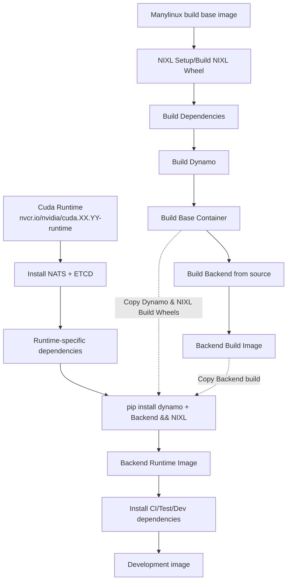

# Dynamo Container Build Process Improvements

**Status**: Ready for Review

**Authors**: [nv-tusharma] 

**Category**: Architecture

**Replaces**: N/A

**Replaced By**: N/A

**Sponsor**: saturley-hall, nv-anants

**Required Reviewers**: nnshah1, saturley-hall, nv-anants, nvda-mesharma, mc-nv, dmitry-tokarev-nv, pvijayakrish

**Review Date**: 2025-07-18

**Pull Request**: TBD

**Implementation PR / Tracking Issue**: TBD

# Summary

This document outlines a container build process optimization strategy for Dynamo to enhance the developer experience by re-organizing Dockerfiles along with defining a clear and maintainable structure for our Dockerfiles. 

One of the goals for this document is to define a clear and maintainable structure for our Dockerfiles. Specifically, to determine how many Dockerfiles we need and clarify the relationships between base, runtime, and development images. The aim is to ensure each environment's Dockerfile builds upon the previous (as supersets), maximizing environment consistency and coverage during daily development and testing. 

To achieve this goal, this document proposes certain optimizations to improve the current build process:
- Restructuring the build process to provide a base container with a pre-built version of Dynamo + NIXL available on all distributions, enabling splitting of specific backends from the dynamo build process.
- Defining a structure/template for all Dockerfiles to follow to ensure consistent and reproducible builds across backends along with specific roles/use cases targeted for each stage.
- Implementing remote compiler caching strategies tools like sccache to significantly reduce rust compilation times across builds and CI/CD pipelines.

# Motivation

Dynamo's current container architecture consists of multiple Dockerfiles in the `/containers` directory of the [Dynamo repository](https://github.com/NVIDIA/Dynamo). These Dockerfiles are organized by backend (vLLM, sglang, TRT-LLM) and contain multiple stages (base, devel, ci, runtime) for different use cases. Each stage includes a Dynamo build, the specific backend, and NIXL - our high-throughput, low-latency point-to-point communication library for accelerating inference. 

The current approach faces several challenges:

1. **Inefficient Build Process**: Components like Dynamo, NIXL, and backends are installed multiple times across stages instead of using a layered approach. Stages do not build upon each other which leads to repeated steps and inefficient build times.

2. **Developer Experience Issues**: The unclear organization of Dockerfiles makes it difficult for developers to choose the right build for their needs, often defaulting to the devel build regardless of use case.

3. **Build Reliability**: The complex layering and repeated steps across stages can lead to intermittent build failures.

4. **Inconsistent Standards**: Without a unified Dockerfile for building Dynamo, NIXL, and dependencies, code is duplicated or missing across backend-specific Dockerfiles, and optimizations aren't shared effectively.

This document proposes solutions to the build process challenges, aiming to improve overall container build efficiency and developer experience.

## Goals

* Remove duplicate code in current dockerfile implementations and define a single build base image which provides a pre-built container with Dynamo + NIXL.

This base image should operate as a single base container which can then be used as base containers for backend-specific images. By leveraging a base container, We can reduce the redundant code across Dockerfiles and establish a single-source of truth for all Dynamo-builds. This would also enable us to replace the current devel container with the base container for local development/public CI for faster validation of changes.

* Define the relationships between base, runtime, and development images for each Dockerfile and provide a structure/template to follow for Dockerfiles. 

* Reduce build flakiness by pinning/fixing dependencies in the base image from package managers and squashing/reducing layers as necessary

Pinning/Fixing dependencies will ensure a unified build environment reducing "it works on my machine" problems or "this worked yesterday"

* Minimize effort for providing multi-arch support across various backends for Dynamo by leveraging manylinux to build for multiple distributions

* Implement remote compiler caching strategies to dramatically reduce build times across development and CI/CD environments

By integrating tools like sccache for remote compilation caching, we can avoid redundant compilation work across builds, significantly speeding up the container build process for both developers and CI pipelines.

### Non Goals

- Container release strategy and processes (covered in separate DEP)
- Unified build environment 

## Requirements

### REQ \<\#1\> \<Backend Integration with Base Container\>
The build-base container must be designed such that backend-specific Dockerfiles can integrate with it with minimal changes to their existing build process. This includes:
- Multi-arch support is a P0. The Base container should be able to support both x84_64 and arm64 builds. 
- Clear documentation on how to use the base container
- Standardized environment variables and paths
- Replace the current devel container with the base container for local development/public CI for faster validation of changes.

### REQ \<\#2\> \<Layered Container Structure\>
Dockerfiles must follow a layered, super-set structure to optimize build efficiency:
- Each stage should build upon the previous stage or use artifacts from the previous stage
- Artifacts should be built only once and reused across stages
- Clear separation between build-time and runtime dependencies
- Minimal layer count to reduce build complexity

### REQ \<\#3\> \<Stage Purpose Definition\>
Each build stage must have a clearly defined purpose and scope:
- Base: NIXL + Dynamo build from a manylinux container (Enables support on multiple platforms)
- Backend Build: Builds the specified backend along with any dependencies required for the backend
- Runtime: Minimal production deployment requirements
- CI: Testing tools and validation requirements built on runtime

# Proposal

In order to address the requirements, we propose the following changes to the Dynamo build process:

## Build-Base Container

The base container will be a pre-built container that will be used by the backends to build the final container image. This build base container will contain a Dynamo build for all backends to use for their framework-specific build. The base image will leverage a manylinux base image to enable support for multiple distributions (U22, U24, etc). The container will also include a NIXL build since this is common across all backends. This will be a new Dockerfile in the /containers directory. Multi-arch support is also a P0 Also, the base container can be used as a drop-in replacement for the current devel container used in public CI. This would significantly reduce public CI build times and enable faster validation of changes. 

## Use-case of build stages along with relationship between stages (base, runtime, dev)

Each backend-specific Dockerfile should follow a specific format. The backend-specific Dockerfiles should be divided up into multiple stages, with each stage inheriting artifacts/leveraging the previous stage as the base container. The following stages should be defined in the backend-specific Dockerfile: 

**Backend Build Stage:**
- Targeted User: Developers
- Base Image: Cuda base devel image
- Functionality: Builds targeted backend along with backend-specific dependencies in editable mode.

**Runtime Stage:**
- Targeted User: Customers/Production
- Base Image: Cuda base runtime image
- Functionality: Minimal image with only the dependencies required to deploy and run Dynamo w/backend from the backend build stage; intended for production deployments. Copies dynamo artifacts from base image and backend artifacts from backend build image.

**Development Stage:**
- Targeted User: Developers/Internal CI Pipelines/Local Debugging
- Base Image: Runtime image
- Functionality: Adds development-specific tools, QA test scripts, internal models, and other dependencies needed for developers. We also want to integrate dev container features into this stage.

The CUDA base images will be used from the [NVIDIA CUDA Container Registry](https://catalog.ngc.nvidia.com/orgs/nvidia/containers/cuda). Please refer to the Pros and Cons section for more details on why we chose to use the cuda runtime image instead of the Deep Learning CUDA image.

# Implementation Details

## Container Build Flow



The diagram above illustrates the proposed container build strategy showing the relationships between:
- Build Base Container with common dependencies
- Backend-specific development containers
- Runtime containers
- Development containers

This layered approach ensures consistent builds, reduces duplication, and improves maintainability across all backend implementations.

## Dockerfile Structure Template

Each backend-specific Dockerfile will follow this standardized structure:

```dockerfile
# Backend Build Stage
FROM nvcr.io/nvidia/cuda:XX.YY-devel-ubuntuXX.XX as backend-build
# Install backend-specific dependencies and build backend

# Runtime Stage  
FROM nvcr.io/nvidia/cuda:XX.YY-runtime-ubuntuXX.XX as runtime
# Copy dynamo and NIXL wheels from base container
# Copy backend artifacts from backend-build stage
# Install runtime dependencies only

# Development Stage
FROM runtime as dev
# Add development-specific tools and test dependencies
```

## Dependency Management

- **Pinned Dependencies**: All dependencies will be pinned to specific versions in the base container
- **Multi-arch Support**: Base container will support both x86_64 and arm64 architectures
- **Minimal Runtime**: Runtime images will only include necessary dependencies for production deployment
- **Layered Caching**: Build layers will be optimized for Docker build cache efficiency

## Build Caching Strategy (Phase 3)

To further optimize build times after the initial Dockerfile restructuring, We will explore remote compiler caching strategies (further optimizations to be added in future):

### Remote Compiler Caching Strategies
- **Compiler cache Integration**: Leverage compiler cache service like [sccache](https://github.com/mozilla/sccache) in the build-base container to cache compilation results for Dynamo, NIXL, and backend dependencies.
- **Remote Cache Storage**: Use a remote cache storage service to store the cached compilation results in CI/CD pipelines.
- **Cache Size Management**: Configure appropriate cache size limits and cleanup policies to balance storage usage with build performance.


### Implementation Considerations
- **Cache Invalidation**: Implement smart cache invalidation based on dependency changes and version updates
- **Monitoring**: Add build time metrics to measure cache effectiveness and identify optimization opportunities
- **CI Integration**: Configure CI/CD pipelines to properly utilize remote caching storage.


# Implementation Phases

## Phase \<\#1\> \<Build Base Container Development\>

**Release Target**: v0.5.0

**Effort Estimate**: 1 engineer, 1 week

**Work Item(s):** N/A

**Supported API / Behavior:**

* Pre-built Build base container with multi-arch support containing Dynamo and NIXL
* NIXL integration in base container
* Manylinux base for broad distribution compatibility
* Standardized environment variables and paths
* Pinned dependencies for base container

**Not Supported:**


## Phase \<\#2\> \<Restructure backend Dockerfiles to follow proposed structure\>

**Release Target**: v0.5.1

**Effort Estimate**: 1 engineer, 1 week

**Work Item(s):** \<one or more links to github issues\>

**Supported API / Behavior:**

* Updated vLLM, sglang, and TRT-LLM Dockerfiles following new structure
* Clear separation between backend build, runtime, and CI stages
* Integration with base container for Dynamo and NIXL dependencies
* Reduced build times through improved layering
* Backward compatibility with existing Dockerfiles
* Pinned dependencies for backend builds

**Not Supported:**

## Phase \<\#3\> \<Build Caching Optimization\>

**Release Target**: v0.5.1

**Effort Estimate**: 1 engineer, 1 week

**Work Item(s):** N/A

**Supported API / Behavior:**

* Integration of sccache for rust compilation caching across container builds
* Remote cache storage for CI/CD pipelines to reduce cold build times
* Cache invalidation strategies for dependency updates and smart cache layer management

**Not Supported:**

* Advanced distributed caching mechanisms

# Related Proposals

**\[Optional \- if not applicable omit\]**

# Alternate Solutions

**\[Required, if not applicable write N/A\]**

List out solutions that were considered but ultimately rejected. Consider free form \- but a possible format shown below.

## Alt \<\# 2\> \<Provide a single container with multi-backend support instead of multiple backend-specific containers\>

**Pros:**

- Reduce overall complexity (less containers, less Dockerfiles)
- No need foradditonal security scans and QA validation.
- Simpler Open Source approval process.

**Cons:**

- Container size, if a user is only interested in one particular backend, we should remove the dependencies associated with other backends. We would need to provide tools for users to create backend-specific containers for their deployment.
- It is expected that Backends can differ on performance, which could be a result of backend-specific dependencies.
- Build times are expected to be longer for a single container with multi-backend support.
- Is it feasible for a user to want deploy multiple inference engines at once with dynamo?

**Reason Rejected:**

- There are more cons than pros for this approach. Along with the cons, the Dynamo base container is a good drop-in replacement for the multi-backend container.

## Alt #3 Published Base Container with Pinned Dependencies

**Description:**

Instead of building NIXL, UCX, and other stable dependencies from source in each build, publish a pre-built base container with these pinned components. This would create a three-tier container hierarchy:

1. **Base Image (Published):** CUDA + NIXL + UCX + uv + cargo + other stable dependencies
2. **Dynamo Image:** Base Image + Dynamo Rust/Python builds  
3. **Framework Image:** Dynamo Image + Framework builds (vLLM, sglang, TRT-LLM)

The base image would be published to a public registry (GitHub Container Registry or NGC) and updated infrequently when NIXL or other core dependencies change.

**Pros:**

- **Dramatically reduced build times:** Skip compilation of NIXL, UCX, and other stable components that rarely change
- **Consistent environment:** All builds use the same pinned versions of core dependencies
- **Simplified maintenance:** Base image updates are centralized and infrequent
- **Better caching:** Base image can be cached across all builds and CI pipelines
- **Reduced CI resource usage:** Less compilation work in CI/CD pipelines
- **Public availability:** Base image could be made available to external users/partners

**Cons:**

- **Additional publishing workflow:** Need separate CI/CD pipeline to build and publish base images
- **Registry management:** Need to manage storage and access for published base images
- **Storage costs:** Published images consume registry storage space
- **Security scanning:** Published base images need regular security scanning and updates
- **Dependency on external registry:** Builds depend on availability of published base image

**Implementation Considerations:**

- **Publishing cadence:** Base image updates triggered by NIXL/UCX version changes or monthly schedule
- **Versioning strategy:** Semantic versioning for base images (e.g., `nvidia/dynamo-base:v1.2.0`)
- **Multi-arch support:** Publish both x86_64 and arm64 variants
- **Registry choice:** GitHub Container Registry (ghcr.io) for open source, NGC for enterprise
- **Fallback strategy:** Ability to build from source if published image unavailable

**Reason Rejected:**

N/A

# Background

**\[Optional \- if not applicable omit\]**

Add additional context and references as needed to help reviewers and authors understand the context of the problem and solution being proposed.

## References

**\[Optional \- if not applicable omit\]**

Add additional references as needed to help reviewers and authors understand the context of the problem and solution being proposed.

* \<hyper-linked title of an external reference resource\>

## Terminology & Definitions

**Base Container:** Pre-built container with Dynamo and NIXL that serves as foundation for backend-specific builds

**Backend Build:** Container stage that builds backend-specific code and dependencies

**sccache:** Compiler cache tool that speeds up recompilation by caching previous compilation results

**CI Stage:** Container stage with testing tools and validation requirements

**Manylinux:** PEP 513 standard for Linux wheel distribution compatibility

**NIXL:** High-throughput, low-latency point-to-point communication library for accelerating inference

**Runtime Stage:** Minimal container stage with only production deployment requirements

## Acronyms & Abbreviations

**CI:** Continuous Integration

**DEP:** Design Enhancement Proposal

**NIXL:** NVIDIA Inference Exchange Library


